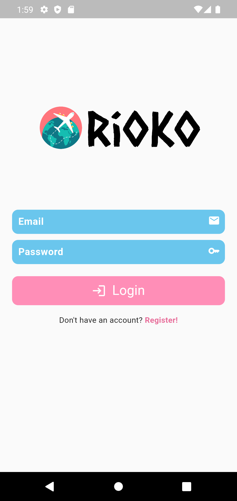
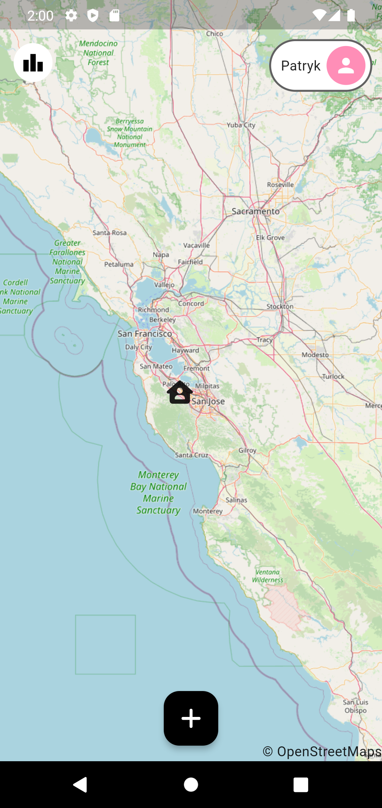
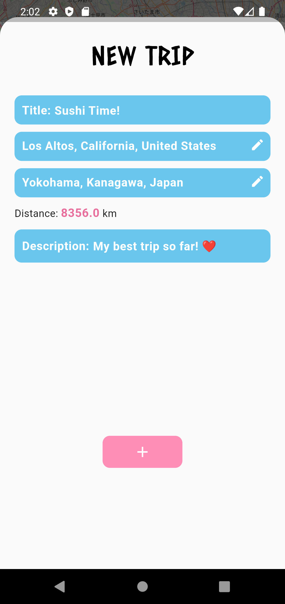
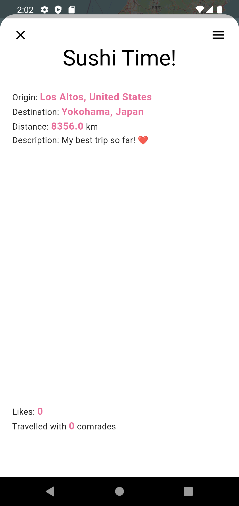
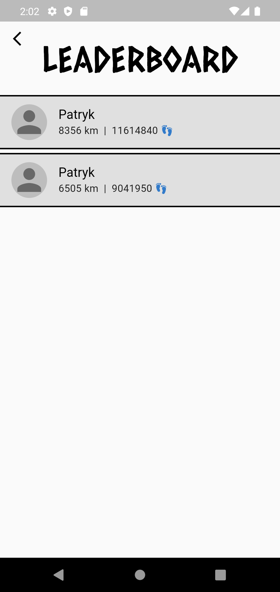
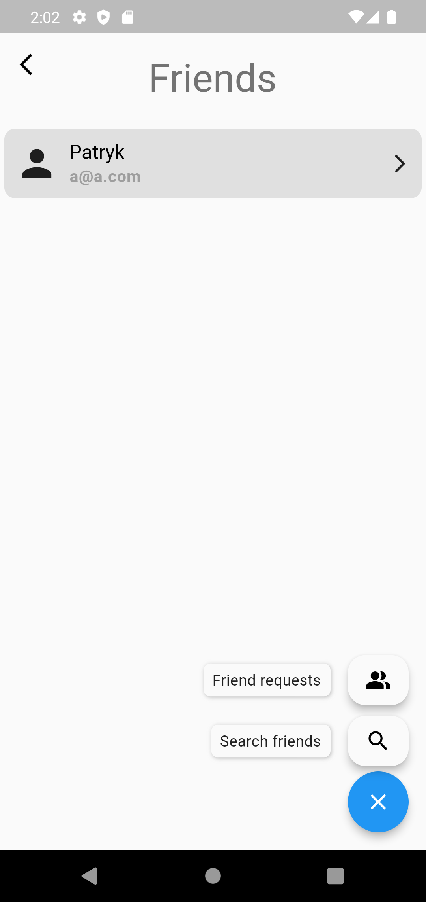

# rioko

Rioko is a social app in which users share their travel memories by 'sticking' pins on a virtual world map. In the app, users will be able to check their friends' virtual boards, compete with them in the top traveller leaderboard and respond to their trips.

The project used: *Provider*, *Freezed*, *Firebase*, *Leaflet*, *MVVM*

## Alpha stage

The app is currently under development, screenshots of the current status will be presented below. Please note that this is an early stage of app development and the UI/UX will be re-created soon.

|                  Login screen                   |                  Map screen                   |
| :---------------------------------------------: | :-------------------------------------------: |
|  |  |
 

|                    Add new trip screen                     |        Trip details screen (new features soon)        |
| :--------------------------------------------------------: | :---------------------------------------------------: |
|  |  |
 

|                        Ranking screen                         |                      Friends Page                      |
| :-----------------------------------------------------------: | :----------------------------------------------------: |
|  |  |